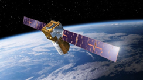
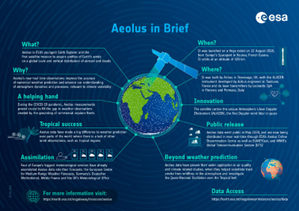
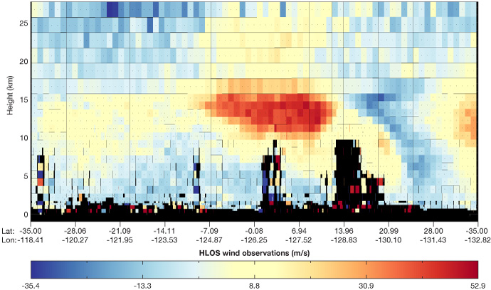

```{r setup, include=FALSE,echo=FALSE}
options(htmltools.dir.version = FALSE)
library(dplyr)
library(readr)
library(readxl)
library(knitr)
```

```{r xaringan-themer, include=FALSE, warning=FALSE}
library(xaringanthemer)
style_duo_accent(primary_color = "#0D5E74", 
                 # secondary_color = "#2881C6",
  header_font_google = google_font("Josefin Sans"),
  text_font_google   = google_font("Montserrat", "300", "300i"),
  code_font_google   = google_font("Fira Mono"),
)
```

```{r xaringan-all, echo=FALSE, warning=FALSE}
library(countdown)
library(xaringan)
library(xaringanExtra)
hook_source <- knitr::knit_hooks$get('source')
knitr::knit_hooks$set(source = function(x, options) {
  x <- stringr::str_replace(x, "^[[:blank:]]?([^*].+?)[[:blank:]]*#<<[[:blank:]]*$", "*\\1")
  hook_source(x, options)
})
xaringanExtra::use_broadcast()
xaringanExtra::use_freezeframe()
xaringanExtra::use_scribble()
#xaringanExtra::use_slide_tone()
xaringanExtra::use_search(show_icon = TRUE, auto_search	=FALSE)
xaringanExtra::use_freezeframe()
xaringanExtra::use_clipboard()
xaringanExtra::use_tile_view()
xaringanExtra::use_panelset()
xaringanExtra::use_editable(expires = 1)
xaringanExtra::use_fit_screen()
xaringanExtra::use_extra_styles(
  hover_code_line = TRUE,         
  mute_unhighlighted_code = TRUE  
)
```

```{r setupbibliography, include=FALSE}
# Code supplied by Andy (see wk2 slides 25-28)
library(RefManageR)
library(knitcitations)
BibOptions(check.entries = FALSE,
           bib.style = "authoryear",
           cite.style = "authoryear",
           style = "markdown",
           hyperlink = TRUE,
           dashed = FALSE,
           no.print.fields=c("doi", "url", "urldate", "issn"))
myBib <- ReadBib("references.bib",
                 # "./Bib.bib", 
                 check = FALSE)
```

class: center, middle

# Atmospheric Dynamics Mission-Aeolus
<br> 

**The first satellite with equipment capable of performing global wind-component-profile observation**
<br> 
<br> 

###Xingru Liu


---

# What is the Aeolus satellite?

- Aeolus is a satellite launched on August 22, 2018 and retired on April 30, 2023.

- Surpassing scientific expectations and exceeding its planned life in orbit, the mission has been hailed as one of ESA’s most successful.

- It is the first satellite mission to acquire Earth's wind profile on a global scale.

- It carries only one large instrument - a laser Doppler wind lidar called Aladin.

```{r echo=FALSE, out.width='40%', fig.align='center'}

```
<small>Aeolus is the world's first satellite to measure wind (ESA)<small>


---

# Aeolus Satellite details

.pull-left[

* Mission type: Weather satellite

* Launcher/Location: Vega/Kourou

* Launch mass: 1,366 kg (3,012 lb)

* Orbit: Sun-synchronous, dawn-dusk; 320 km (200 mi)

* Inclination: 97.0°

* Technology type: The Aladin sensor is a laser radar (LIDAR) system, specifically it uses UV laser pulses to make measurements.
]

.pull-right[
```{r echo=FALSE, out.width='150%', fig.align='right'}

```
<br> 
<small>(European Space Agency, no date)<small>
]

---

###The Aeolus mission objectives were to provide accurate global measurements of winds from the surface up to 30 km.

**The Aeolus mission has contributed to:**

-	Improving weather forecasts for society

-	Understanding atmospheric dynamics

-	Providing information on aerosols and clouds

-	Filling the current major gap in the atmospheric observing system

-	nderstanding climate change

-	Helping to track air pollution

-	Tracking desert dust, smoke and volcanic ash

-	Wind-energy management

-	Paving the way for future wind lidar missions


---

# Imagery examples

.pull-left[

```{r echo=FALSE, out.width='150%', fig.align='right'}

```


This example of simulated Aeolus horizontal-line-of-sight (HLOS) wind observations(European Centre for Medium-Range Weather Forecasts).
]


.pull-right[
```{r echo=FALSE, out.width='150%', fig.align='right'}
knitr::include_graphics("img/wx4.jpg")
```


VirES visualisation of the Aeolus wind curtain with RBS settings on 16 July 2020(European Space Agency).
]


---

# Significance of Aeolus

<br> 

- **Aeolus pioneered the safe return of uncontrolled re-entry satellites to Earth, but not before it became the first satellite ever to acquire vertical profiles of Earth's winds on a global scale.**

<br> <!-- 这里添加额外的空行 -->


- **Aeolus is a pre-operational mission that demonstrates new laser technology and paves the way for future weather satellites to measure atmospheric winds.**

<br> 


- **It uses a laser Doppler wind lidar called Aladin, the first such instrument ever launched into space.**


---

## Application

**Using wind observations from the Aeolus to estimate numerical weather forecasts model Harmonie–Arome (Hagelin et al., 2021)**

In this study, 3D-Var data assimilation is used to assimilate horizontal line-of-sight (HLOS) winds observed by Aeolus over two different periods to determine the quality of the observations of Aeolus. The differences between the O-B and O-A-SD profiles and the DFS analysis show that the Aeolus data have an impact on the analysis, while the impact of the forecasts is neutral compared to the radiosonde. The study focuses on the observation error standard deviation, while potential observation error correlations are not addressed.

**Using the newly released Aeolus wind product for weather forecasting operations in China (Gue et al., 2021)<br>**

In this study, the Mie cloudy and Rayleigh clear wind products of the Aeolus satellites were evaluated by using wind observations from the Chinese Radar Wind Profiler (RWP) network. Based on the geographic matching of RWP stations with Aeolus satellite tracks, the study defines three matching categories, and these categories of Aeolus wind products are separately analyzed in comparison with the wind observations from RWP. The results show that the Aeolus wind products match well with the wind observations from the Chinese RWP network.


---

## Application

**First validation of Aeolus wind observations by airborne Doppler wind lidar measurements (Witschas, 2020)**


In this study, two airborne campaigns were conducted with two wind lidars on DLR's Falcon aircraft to validate the ESA's Aeolus mission. In this paper, the systematic and random errors of the Aeolus HLOS wind observations were determined by 2 μm DWL. The results confirm the need to validate the Aeolus wind product and demonstrate that the DLR airborne wind lidar payload is well suited for this mission.
---

# Reflection

- Aeolus Satellite's Wind Data Significantly Improves Global Weather Forecasts

- I feel that the Aeolus satellite is a pioneer of the space age, and its unique record of global wind data will provide valuable insights long after the mission has ended and returned to the atmosphere.

- The Aeolus satellite plays a key role in improving weather forecasting. The satellite's wind data has significantly improved global weather forecasts.

- Aeolus enables scientists to build complex models of our environment that can then be used to help predict how that environment will behave in the future.

- For example, determining what we will wear tomorrow in our daily lives requires an understanding of looking at the weather forecast and choosing the right clothes based on the temperature.


---
# Reflection

- In addition, Aeolus provides data in areas of the globe that are difficult to measure, such as the tropics. This opens the door for mankind to explore the uncharted territories of the earth.

- In my opinion, without the success of Aeolus, progress in the field of weather forecasting would not be as accurate as it is now.

- The fact that Aeolus data is now used as part of the operational weather forecasting process is a testament to its quality and reliability. I have seen the skill and determination of the engineers in developing this new technology. I am really happy and proud of it.

- In the future, I think its success also paves the way for possible future deployment of Doppler wind lidar satellites in space. Our goal is to keep the Aeolus data running for as long as possible. At the same time, we need to learn how to make better use of these data in order to fully utilize their potential.

---

# References


<small>European Centre for Medium-Range Weather Forecasts (2018) Available at: https://www.ecmwf.int/en/about/media-centre/news/2018/aeolus-satellite-launch-paves-way-better-forecasts (Accessed: 27 January 2024)

European Space Agency (2020) Available at: https://earth.esa.int/eogateway/news/a-guide-to-aeolus-range-bin-settings (Accessed: 27 January 2024)

European Space Agency (no date) Available at: https://earth.esa.int/eogateway/missions/aeolus/description (Accessed: 27 January 2024)

Guo, J. P., Liu, B. M., Gong, W., Shi, L. J., Zhang, Y., Ma, Y. Y., Zhang, J., Chen, T.M., Bai, K. X., Stoffelen, A., Leeuw, G. D. and Xu, X. F. (2021) ‘Technical note: First comparison of wind observations from ESA's satellite mission Aeolus and ground-based radar wind profiler network of China’, European Geosciences Union, 21(4), pp. 2945-2958.

Hagelin, S., Azad, R., Lindskog, M., Schyberg, H. and Kornich, H. (2021) ‘Evaluating the use of Aeolus satellite observations in the regional numerical weather prediction (NWP) model Harmonie–Arome’, European Geosciences Union, 14(9), pp. 5925-5938.

Witschas, B., Lemmerz, C., Geiß, A., Lux, O. Marksteiner, U., Rahm, S., Reitebuch, O. and Weiler, F. (2020) ‘First validation of Aeolus wind observations by airborne Doppler wind lidar measurements’, Aeolus data and their application (AMT/ACP/WCD inter-journal SI), 13(5), pp. 2381-2396.<small>


